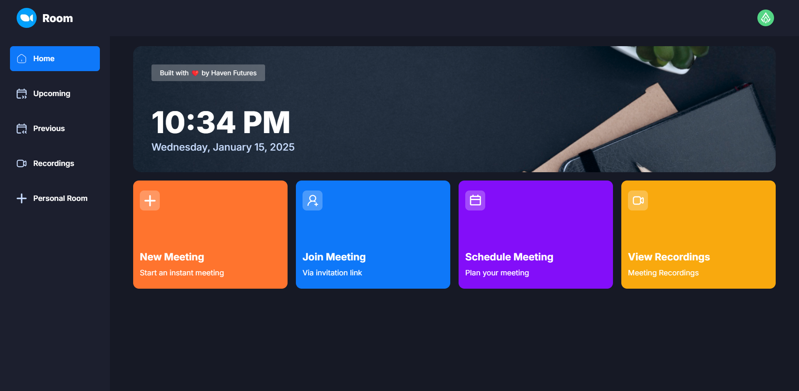

### Room

Virtual Room is an enterprise-level video and audio conferencing web application designed to facilitate seamless meetings and collaborations. Packed with an array of impressive features, it enables users to connect effortlessly, whether for team meetings, webinars, or client presentations.

### Preview



### <a name="table">Table of Contents</a>

1. [Tech Stack](#tech-stack)
2. [Features](#features)
3. [Getting Started](#getting-started)
4. [Feedback](#feedback)
5. [Contributors](#contributors)

### <a name="tech-stack">Tech Stack</a>

- Next.js
- TypeScript
- HTML5
- CSS3
- Clerk
- Getstream
- Node.js
- NPM
- Tailwind CSS

### <a name="features">Features</a>

- **Authentication**: Implements authentication and authorization features using Clerk, allowing users to securely log in via social sign-on or traditional email and password methods, while ensuring appropriate access levels and permissions within the platform.

- **New Meeting**: Quickly start a new meeting, configuring camera and microphone settings before joining.

- **Meeting Controls**: Participants have full control over meeting aspects, including recording, emoji reactions, screen sharing, muting/unmuting, sound adjustments, grid layout, participant list view, and individual participant management (pinning, muting, unmuting, blocking, allowing video share).

- **Exit Meeting**: Participants can leave a meeting, or creators can end it for all attendees.

- **Schedule Future Meetings**: Input meeting details (date, time) to schedule future meetings, accessible on the 'Upcoming Meetings' page for sharing the link or immediate start.

- **Past Meetings List**: Access a list of previously held meetings, including details and metadata.

- **View Recorded Meetings**: Access recordings of past meetings for review or reference.

- **Personal Room**: Users have a personal room with a unique meeting link for instant meetings, shareable with others.

- **Join Meetings via Link**: Easily join meetings created by others by providing a link.

- **Secure Real-time Functionality**: All interactions within the platform are secure and occur in real-time, maintaining user privacy and data integrity.

- **Responsive Design**: Follows responsive design principles to ensure optimal user experience across devices, adapting seamlessly to different screen sizes and resolutions.

### <a name="getting-started">Getting Started</a>

### Prerequisites

- [Git](https://git-scm.com/)
- [Node.js](https://nodejs.org/en)
- [npm](https://www.npmjs.com/) (Node Package Manager)

### Cloning

1. **Cloning:** 

    Run the following command in your terminal or command prompt to clone the repository to your local machine:

    ```bash
        https://github.com/VIKASRAPARTHI/Virtual-Room.git
    ```

2. **Navigate to the Directory:** 
    
    Once cloned, navigate into the project directory using the `cd` command:

    ```bash
    cd room
    ```

### Download

1. **Download ZIP Code folder:** 

    Unzip the folder in your machine.

2. **Navigate to the Downloaded Directory:** 

    Open your code editor and open the unzipped folder in it then:

    ```bash
    cd /path/to/downloaded/folder
    ```

### Cloning & Download

1. **Dependencies Installation:**

    ```bash
    npm install
    ```

2. **Environment Variables & Database Setup:** 

    Create a new file named `.env` in the root of your project and add the following content:

    ```env
    NEXT_PUBLIC_CLERK_PUBLISHABLE_KEY=
    CLERK_SECRET_KEY=

    NEXT_PUBLIC_CLERK_SIGN_IN_URL=/sign-in
    NEXT_PUBLIC_CLERK_SIGN_UP_URL=/sign-up

    NEXT_PUBLIC_STREAM_API_KEY=
    STREAM_SECRET_KEY=
    ```

    Replace the placeholder values with your actual Clerk & getstream credentials. You can obtain these credentials by signing up on the [Clerk website](https://clerk.com/) and [Getstream website](https://getstream.io/)
    
3. **Running:**

    ```bash
    npm run dev
    ```

    Open [http://localhost:3000](http://localhost:3000) in your browser to view the project.

4. **Start Coding:** 

    Feel free to edit the code according to your requirements. 

5. **Testing**

    ```bash
    npm test
    ```

6. **Build for Production**

    ```bash
    npm run build
    ```

### Github

1. **Initialize a New Git Repository:**

    ```bash
    git init
    ```

2. **Stage and Commit the Code:**

    ```bash
    git add .
    git commit -m "Initial commit"
    ```

3. **Create a New Repository on GitHub:**

    Do not initialize the new repository with a README, .gitignore, or license.

4. **Link Local Repository to GitHub:**

    ```bash
    git remote add origin https://github.com/username/new-repo.git
    ```

    Replace https://github.com/username/new-repo.git with your actual repository URL.

5. **Push Code to GitHub:**

    ```bash
    git branch -m main
    git pull origin main
    git push -u origin main
    ```

6. **Deployment:** 
    
    Deploy the application to your preferred hosting platform to make it accessible online.


### Forking

1. **Forking:** 

    Run the following command in your terminal or command prompt to fork the repository to your local machine:

    ```bash
    git clone https://github.com/your-username/room.git
    ```

2. **Navigate to the Directory:** 

    Once cloned, navigate into the project directory using the `cd` command:

    ```bash
    cd room
    ```

3. **Start Coding:** 

    Make the additions & desired changes to the code.

4. **Commit & Push Your Changes to Your Fork:** 

    Once cloned, navigate into the project directory using the `cd` command:

    ```bash
    git add .
    git commit -m ""
    git pull origin main
    git push -u origin main
    ```

5. **Create a Pull Request:**

- Go to your forked repository on GitHub
- Click the "Compare & pull request" button.
- Review your changes and write a clear description of your contribution.
- Click "Create pull request"

    **I will review your pull request and decide whether to merge your changes into my repository or not**

### <a name="feedback">Feedback</a>

You might encounter some bugs while using this app. You are more than welcome to contribute. Just submit changes via pull request and I will review them before merging. Make sure you follow community guidelines.

Happy coding!